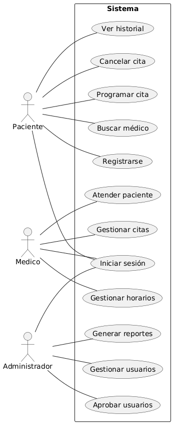
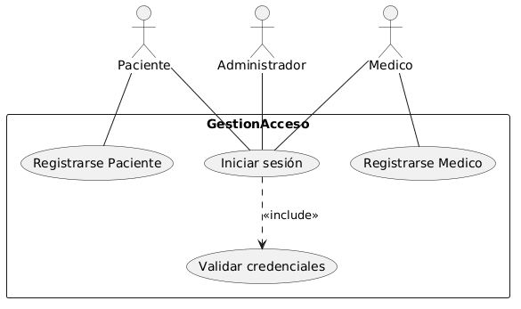
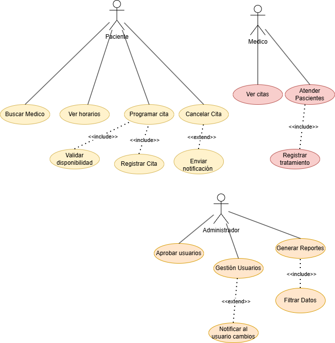
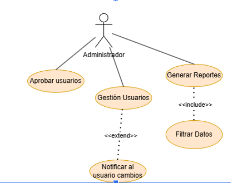

# Documentación de Casos de Uso — SaludPlus
**Sistema:** SaludPlus — Plataforma de Gestión de Citas Médicas  
**Curso:** Análisis y Diseño de Sistemas 1 — USAC FIUSAC  
**Grupo:** 3  

| Nombre | Carnet |
|--------|--------|
| Allan Josué Rafael Morales | 201709196 |
| Roger Alberto Rivera Alvarez | 201800551 |
| Wilmer Estuardo Vásquez Raxón | 201800678 |
| Anderson Gerardo Zuleta Galdámez | 201800500 |

---

## Core del Negocio

El core del negocio del sistema SaludPlus corresponde a la **gestión eficiente de citas médicas**, permitiendo la interacción entre pacientes, médicos y administradores dentro de una plataforma digital.

El sistema permite:
- Registrar pacientes y médicos.
- Programar citas médicas.
- Gestionar la agenda médica.
- Registrar atención médica.
- Administrar usuarios del sistema.

El objetivo principal del sistema es optimizar la programación y gestión de consultas médicas mediante una plataforma centralizada que facilite la interacción entre los actores del sistema.

### Subdominios del Sistema

| Subdominio | Descripción |
|-----------|-------------|
| Gestión de Acceso | Manejo de registro y autenticación |
| Gestión de Citas | Programación y cancelación de citas |
| Gestión de Agenda Médica | Administración de horarios |
| Gestión Administrativa | Control de usuarios y reportes |

### Actores del Sistema

| Actor | Descripción |
|-------|-------------|
| Paciente | Usuario que solicita y gestiona citas médicas |
| Médico | Profesional de salud que atiende consultas |
| Administrador | Usuario encargado de gestionar el sistema |

---

## Diagramas de Caso de Uso — Core del Sistema

> En este diagrama solo se muestran las funcionalidades principales del sistema sin entrar en detalles internos.

**Paciente:** Registrarse, Iniciar Sesión, Buscar Médico, Programar Cita, Cancelar Cita, Ver Historial Médico

**Médico:** Iniciar Sesión, Gestionar Citas, Atender Pacientes, Gestionar Horarios

**Administrador:** Iniciar Sesión, Aprobar Usuarios, Gestionar Usuarios, Generar Reportes

---

## Primera Descomposición

### CDU — Gestión de Acceso

Este módulo se encarga de la autenticación y registro de usuarios.

**Casos de uso:**
- Registrarse Paciente
- Registrarse Médico
- Iniciar sesión
- Validar credenciales
- Autenticación administrativa

---

### CDU — Gestión de Citas

Este módulo representa el proceso principal del sistema, relacionado con la programación y atención de consultas médicas.

**Casos de uso — Paciente:** Buscar médico, Ver horarios disponibles, Programar cita, Cancelar cita, Ver historial

**Casos de uso — Médico:** Ver citas, Atender paciente, Registrar tratamiento

---

### CDU — Gestión Administrativa

Este módulo se encarga del control administrativo del sistema: aprobación de usuarios, gestión de cuentas y generación de reportes.

**Casos de uso:** Iniciar Sesión, Aprobar Usuarios, Gestionar Usuarios, Generar Reportes

---

## Casos de Uso del Negocio

---

### CU-01 — Registrarse Paciente

**1. Información General**

| Campo | Detalle |
|-------|---------|
| **ID** | CU-01 |
| **Nombre** | Registrarse Paciente |
| **Actor Principal** | Paciente |
| **Actores Secundarios** | Sistema, Administrador |
| **Tipo** | Primario |
| **Prioridad** | Alta |
| **Descripción** | Permite a una persona registrarse como paciente en el sistema SaludPlus proporcionando sus datos personales para crear una cuenta de acceso. |

**2. Precondiciones**
- El sistema debe estar disponible y accesible.
- El usuario no debe estar registrado previamente con el mismo correo electrónico.

**3. Postcondiciones**

*Éxito:*
- El paciente queda registrado en el sistema con estado 'Pendiente de aprobación'.
- El paciente recibe una notificación de confirmación en su correo.

*Fallo:*
- El registro no se completa y el sistema muestra un mensaje de error indicando el motivo.

**4. Flujo Principal**

| Paso | Acción |
|------|--------|
| 1 | El usuario accede a la opción 'Registrarse como Paciente'. |
| 2 | El sistema muestra el formulario de registro (nombre, apellido, correo, contraseña, fecha de nacimiento, teléfono). |
| 3 | El usuario completa todos los campos requeridos. |
| 4 | El sistema valida que el correo no esté registrado previamente. |
| 5 | El sistema valida el formato y completitud de los datos. |
| 6 | El sistema crea la cuenta con estado 'Pendiente de aprobación'. |
| 7 | El sistema envía una confirmación de registro al correo del paciente. |
| 8 | El sistema muestra un mensaje de registro exitoso. |

**5. Flujos Alternos**

*A1 — Correo ya registrado:*

| Paso | Acción |
|------|--------|
| 1 | El sistema detecta que el correo ya existe en la base de datos. |
| 2 | El sistema muestra el mensaje: 'El correo ya está registrado'. |
| 3 | El usuario puede ingresar otro correo o acceder a Iniciar Sesión. |

*A2 — Datos inválidos o incompletos:*

| Paso | Acción |
|------|--------|
| 1 | El sistema detecta campos vacíos o con formato incorrecto. |
| 2 | El sistema resalta los campos con error y muestra mensajes de validación. |
| 3 | El usuario corrige los datos y vuelve a intentar el registro. |

**6. Reglas de Negocio**
- RN01: El correo electrónico debe ser único en el sistema.
- RN02: La contraseña debe tener al menos 8 caracteres.
- RN03: Todos los campos obligatorios deben estar completos.
- RN04: El registro queda en estado 'Pendiente' hasta ser aprobado por el administrador.

**7. Frecuencia de Uso**

Alta. Se ejecuta cada vez que un nuevo paciente desea acceder al sistema.

**8. Observaciones**

Pertenece al módulo de Gestión de Acceso. El administrador debe aprobar el registro antes de que el paciente pueda programar citas.

---

### CU-02 — Registrarse Médico

**1. Información General**

| Campo | Detalle |
|-------|---------|
| **ID** | CU-02 |
| **Nombre** | Registrarse Médico |
| **Actor Principal** | Médico |
| **Actores Secundarios** | Sistema, Administrador |
| **Tipo** | Primario |
| **Prioridad** | Alta |
| **Descripción** | Permite a un profesional de salud registrarse en el sistema como médico, proporcionando sus datos personales y credenciales profesionales para ser habilitado en la plataforma. |

**2. Precondiciones**
- El sistema debe estar disponible.
- El médico no debe estar registrado previamente con el mismo número de colegiado o correo.

**3. Postcondiciones**

*Éxito:*
- El médico queda registrado con estado 'Pendiente de aprobación'.
- El administrador recibe una notificación para revisar el registro.

*Fallo:*
- El registro no se completa y el sistema informa el motivo del fallo.

**4. Flujo Principal**

| Paso | Acción |
|------|--------|
| 1 | El médico accede a la opción 'Registrarse como Médico'. |
| 2 | El sistema muestra el formulario (nombre, especialidad, número de colegiado, correo, contraseña, teléfono). |
| 3 | El médico completa todos los campos requeridos. |
| 4 | El sistema valida que el número de colegiado y el correo sean únicos. |
| 5 | El sistema valida el formato de los datos ingresados. |
| 6 | El sistema crea la cuenta con estado 'Pendiente de aprobación'. |
| 7 | El sistema notifica al administrador sobre un nuevo médico pendiente de aprobación. |
| 8 | El sistema confirma al médico que su solicitud fue recibida. |

**5. Flujos Alternos**

*A1 — Número de colegiado duplicado:*

| Paso | Acción |
|------|--------|
| 1 | El sistema detecta que el número de colegiado ya existe. |
| 2 | El sistema muestra el mensaje: 'El número de colegiado ya está registrado'. |
| 3 | El médico puede verificar sus datos o contactar al administrador. |

*A2 — Correo ya registrado:*

| Paso | Acción |
|------|--------|
| 1 | El sistema detecta que el correo ya existe. |
| 2 | El sistema muestra el mensaje: 'El correo electrónico ya está en uso'. |
| 3 | El médico ingresa un correo diferente. |

**6. Reglas de Negocio**
- RN01: El número de colegiado médico debe ser único en el sistema.
- RN02: El correo electrónico debe ser único.
- RN03: La especialidad debe seleccionarse de una lista predefinida.
- RN04: El administrador debe aprobar la cuenta antes de que el médico pueda operar.

**7. Frecuencia de Uso**

Media. Se ejecuta cuando un nuevo médico solicita acceso al sistema.

**8. Observaciones**

Pertenece al módulo de Gestión de Acceso. A diferencia del registro de pacientes, requiere verificación de credenciales profesionales.

---

### CU-03 — Iniciar Sesión

**1. Información General**

| Campo | Detalle |
|-------|---------|
| **ID** | CU-03 |
| **Nombre** | Iniciar Sesión |
| **Actor Principal** | Paciente / Médico / Administrador |
| **Actores Secundarios** | Sistema |
| **Tipo** | Primario |
| **Prioridad** | Alta |
| **Descripción** | Permite a cualquier usuario registrado y aprobado autenticarse en el sistema SaludPlus mediante su correo electrónico y contraseña para acceder a las funcionalidades de su rol. |

**2. Precondiciones**
- El usuario debe estar registrado en el sistema.
- La cuenta del usuario debe estar aprobada y activa.
- El sistema debe estar disponible.

**3. Postcondiciones**

*Éxito:*
- El usuario accede al sistema y visualiza el panel correspondiente a su rol.

*Fallo:*
- El acceso es denegado y el sistema mantiene la sesión cerrada.

**4. Flujo Principal**

| Paso | Acción |
|------|--------|
| 1 | El usuario accede a la página principal del sistema. |
| 2 | El sistema muestra el formulario de inicio de sesión (correo y contraseña). |
| 3 | El usuario ingresa su correo electrónico y contraseña. |
| 4 | El sistema valida el formato de los datos ingresados. |
| 5 | El sistema verifica las credenciales contra la base de datos. |
| 6 | El sistema identifica el rol del usuario autenticado. |
| 7 | El sistema redirige al usuario a su panel correspondiente. |
| 8 | El sistema registra la sesión activa del usuario. |

**5. Flujos Alternos**

*A1 — Credenciales incorrectas:*

| Paso | Acción |
|------|--------|
| 1 | El sistema detecta que el correo o la contraseña no coinciden. |
| 2 | El sistema muestra el mensaje: 'Correo o contraseña incorrectos'. |
| 3 | El usuario puede volver a intentarlo o usar la opción 'Recuperar contraseña'. |

*A2 — Cuenta pendiente de aprobación:*

| Paso | Acción |
|------|--------|
| 1 | El sistema detecta que la cuenta existe pero no ha sido aprobada. |
| 2 | El sistema muestra el mensaje: 'Tu cuenta está pendiente de aprobación'. |
| 3 | El sistema informa al usuario que debe esperar la notificación de activación. |

*A3 — Cuenta desactivada:*

| Paso | Acción |
|------|--------|
| 1 | El sistema detecta que la cuenta fue desactivada por el administrador. |
| 2 | El sistema muestra el mensaje: 'Tu cuenta ha sido desactivada. Contacta al administrador'. |
| 3 | El sistema no permite el acceso. |

**6. Reglas de Negocio**
- RN01: Las credenciales deben coincidir exactamente con los registros del sistema.
- RN02: Solo las cuentas con estado 'Aprobado' y 'Activo' pueden iniciar sesión.
- RN03: El sistema debe registrar la fecha y hora de cada inicio de sesión.
- RN04: Después de 5 intentos fallidos, la cuenta debe bloquearse temporalmente.

**7. Frecuencia de Uso**

Muy Alta. Es el punto de entrada obligatorio para todos los actores del sistema.

**8. Observaciones**

Pertenece al módulo de Gestión de Acceso. Es prerequisito para todos los demás casos de uso del sistema.

---

### CU-04 — Programar Cita

**1. Información General**

| Campo | Detalle |
|-------|---------|
| **ID** | CU-04 |
| **Nombre** | Programar Cita |
| **Actor Principal** | Paciente |
| **Actores Secundarios** | Sistema, Médico |
| **Tipo** | Primario |
| **Prioridad** | Alta |
| **Descripción** | Permite al paciente seleccionar un médico y un horario disponible para programar una cita médica dentro del sistema. |

**2. Precondiciones**
- El paciente debe estar registrado en el sistema.
- El paciente debe haber iniciado sesión.
- Debe existir al menos un médico disponible en el sistema.

**3. Postcondiciones**

*Éxito:*
- La cita queda registrada en el sistema.
- El médico y el paciente pueden visualizar la cita programada.

*Fallo:*
- La cita no se registra y el sistema muestra un mensaje de error al usuario.

**4. Flujo Principal**

| Paso | Acción |
|------|--------|
| 1 | El paciente accede a la opción Programar Cita. |
| 2 | El sistema muestra la lista de médicos disponibles. |
| 3 | El paciente selecciona un médico. |
| 4 | El sistema muestra los horarios disponibles del médico. |
| 5 | El paciente selecciona un horario. |
| 6 | El sistema valida la disponibilidad del horario. |
| 7 | El sistema registra la cita en la base de datos. |
| 8 | El sistema muestra una confirmación de cita programada. |

**5. Flujos Alternos**

*A1 — No hay horarios disponibles:*

| Paso | Acción |
|------|--------|
| 1 | El sistema detecta que el médico no tiene horarios disponibles. |
| 2 | El sistema muestra un mensaje indicando que no hay horarios disponibles. |
| 3 | El paciente puede seleccionar otro médico. |

*A2 — Horario ya reservado:*

| Paso | Acción |
|------|--------|
| 1 | El sistema detecta que el horario seleccionado ya fue reservado. |
| 2 | El sistema muestra un mensaje de horario no disponible. |
| 3 | El paciente selecciona otro horario. |

**6. Reglas de Negocio**
- RN01: Un paciente solo puede reservar un horario disponible.
- RN02: Un médico no puede tener dos citas en el mismo horario.
- RN03: Las citas deben registrarse con fecha, hora, paciente y médico.

**7. Frecuencia de Uso**

Alta. Este caso de uso se ejecuta cada vez que un paciente necesita programar una consulta médica.

**8. Observaciones**

Este caso de uso pertenece al módulo Gestión de Citas, el cual forma parte del core del negocio del sistema.

---

### CU-05 — Cancelar Cita

**1. Información General**

| Campo | Detalle |
|-------|---------|
| **ID** | CU-05 |
| **Nombre** | Cancelar Cita |
| **Actor Principal** | Paciente |
| **Actores Secundarios** | Sistema, Médico |
| **Tipo** | Primario |
| **Prioridad** | Alta |
| **Descripción** | Permite al paciente cancelar una cita médica previamente programada, liberando el horario para que pueda ser utilizado por otro paciente. |

**2. Precondiciones**
- El paciente debe estar autenticado en el sistema.
- Debe existir al menos una cita programada a nombre del paciente.
- La cita debe estar dentro del plazo permitido para cancelación.

**3. Postcondiciones**

*Éxito:*
- La cita es cancelada en el sistema.
- El horario queda disponible nuevamente y el médico es notificado.

*Fallo:*
- La cancelación no se procesa y la cita permanece activa en el sistema.

**4. Flujo Principal**

| Paso | Acción |
|------|--------|
| 1 | El paciente accede a la sección 'Mis Citas'. |
| 2 | El sistema muestra la lista de citas programadas del paciente. |
| 3 | El paciente selecciona la cita que desea cancelar. |
| 4 | El sistema muestra el detalle de la cita y solicita confirmación. |
| 5 | El paciente confirma la cancelación. |
| 6 | El sistema verifica que la cita esté dentro del plazo permitido de cancelación. |
| 7 | El sistema actualiza el estado de la cita a 'Cancelada'. |
| 8 | El sistema libera el horario en la agenda del médico. |
| 9 | El sistema notifica al médico sobre la cancelación. |
| 10 | El sistema muestra un mensaje de cancelación exitosa al paciente. |

**5. Flujos Alternos**

*A1 — Fuera del plazo de cancelación:*

| Paso | Acción |
|------|--------|
| 1 | El sistema detecta que la cita está fuera del plazo permitido para cancelar (menos de 2 horas). |
| 2 | El sistema muestra el mensaje: 'No es posible cancelar la cita con menos de 2 horas de anticipación'. |
| 3 | El paciente puede contactar al médico directamente. |

*A2 — Cita ya atendida o cancelada:*

| Paso | Acción |
|------|--------|
| 1 | El sistema detecta que la cita ya tiene estado 'Atendida' o 'Cancelada'. |
| 2 | El sistema informa al paciente que la cita ya no puede ser modificada. |
| 3 | El sistema muestra el estado actual de la cita. |

**6. Reglas de Negocio**
- RN01: Las cancelaciones deben realizarse con al menos 2 horas de anticipación.
- RN02: Solo el paciente titular de la cita puede cancelarla.
- RN03: El horario liberado debe quedar disponible automáticamente en el sistema.
- RN04: El médico debe ser notificado de toda cancelación.

**7. Frecuencia de Uso**

Media. Se ejecuta cuando un paciente no puede asistir a su cita programada.

**8. Observaciones**

Pertenece al módulo de Gestión de Citas. La política de cancelación puede ser configurada por el administrador.

---

### CU-06 — Atender Paciente

**1. Información General**

| Campo | Detalle |
|-------|---------|
| **ID** | CU-06 |
| **Nombre** | Atender Paciente |
| **Actor Principal** | Médico |
| **Actores Secundarios** | Sistema, Paciente |
| **Tipo** | Primario |
| **Prioridad** | Alta |
| **Descripción** | Permite al médico registrar la atención de una consulta médica, documentando el diagnóstico, tratamiento prescrito y observaciones clínicas del paciente. |

**2. Precondiciones**
- El médico debe estar autenticado en el sistema.
- Debe existir una cita programada para el paciente en la fecha y hora actuales o pasadas.
- La cita debe estar en estado 'Programada' o 'En Atención'.

**3. Postcondiciones**

*Éxito:*
- La atención queda registrada en el sistema.
- El historial médico del paciente se actualiza con el diagnóstico y tratamiento.

*Fallo:*
- La atención no se registra y el estado de la cita permanece sin cambios.

**4. Flujo Principal**

| Paso | Acción |
|------|--------|
| 1 | El médico accede a su agenda y selecciona la cita a atender. |
| 2 | El sistema muestra la información del paciente y el historial médico previo. |
| 3 | El médico cambia el estado de la cita a 'En Atención'. |
| 4 | El médico registra el diagnóstico de la consulta. |
| 5 | El médico registra el tratamiento o medicamentos prescritos. |
| 6 | El médico agrega observaciones clínicas adicionales si corresponde. |
| 7 | El médico confirma el registro de la atención. |
| 8 | El sistema actualiza el estado de la cita a 'Atendida'. |
| 9 | El sistema actualiza el historial médico del paciente. |
| 10 | El sistema registra la fecha y hora de la atención. |

**5. Flujos Alternos**

*A1 — Paciente no asistió:*

| Paso | Acción |
|------|--------|
| 1 | El médico indica que el paciente no se presentó a la cita. |
| 2 | El sistema actualiza el estado de la cita a 'No Asistió'. |
| 3 | El sistema registra la inasistencia en el historial del paciente. |

*A2 — Error al guardar el registro:*

| Paso | Acción |
|------|--------|
| 1 | El sistema detecta un error al intentar guardar la información. |
| 2 | El sistema muestra un mensaje de error y solicita reintentar. |
| 3 | El médico puede guardar nuevamente o reportar el problema. |

**6. Reglas de Negocio**
- RN01: Solo el médico asignado a la cita puede registrar la atención.
- RN02: El diagnóstico y tratamiento son campos obligatorios para completar la atención.
- RN03: El historial médico del paciente debe actualizarse de forma inmediata.
- RN04: Una cita atendida no puede ser modificada posteriormente sin autorización.

**7. Frecuencia de Uso**

Alta. Se ejecuta por cada consulta médica realizada en el sistema.

**8. Observaciones**

Pertenece al módulo de Gestión de Citas. La información registrada forma parte del historial clínico del paciente.

---

### CU-07 — Gestionar Horarios Médicos

**1. Información General**

| Campo | Detalle |
|-------|---------|
| **ID** | CU-07 |
| **Nombre** | Gestionar Horarios Médicos |
| **Actor Principal** | Médico |
| **Actores Secundarios** | Sistema |
| **Tipo** | Primario |
| **Prioridad** | Alta |
| **Descripción** | Permite al médico configurar y administrar su agenda de horarios disponibles, definiendo los días y franjas horarias en que puede atender pacientes. |

**2. Precondiciones**
- El médico debe estar autenticado en el sistema.
- La cuenta del médico debe estar activa y aprobada.

**3. Postcondiciones**

*Éxito:*
- Los horarios del médico quedan configurados.
- Los horarios son visibles para los pacientes al momento de programar citas.

*Fallo:*
- Los cambios no se guardan y la agenda del médico permanece sin modificaciones.

**4. Flujo Principal**

| Paso | Acción |
|------|--------|
| 1 | El médico accede a la sección 'Gestionar Horarios'. |
| 2 | El sistema muestra la agenda actual del médico (horarios configurados). |
| 3 | El médico selecciona la acción: agregar, modificar o eliminar horario. |
| 4 | El sistema muestra el formulario correspondiente a la acción seleccionada. |
| 5 | El médico ingresa o modifica los datos del horario (día, hora inicio, hora fin). |
| 6 | El sistema valida que el horario no se traslape con uno existente. |
| 7 | El sistema valida que no haya citas programadas en el horario a eliminar/modificar. |
| 8 | El sistema guarda los cambios en la agenda del médico. |
| 9 | El sistema confirma la operación con un mensaje de éxito. |

**5. Flujos Alternos**

*A1 — Traslape de horarios:*

| Paso | Acción |
|------|--------|
| 1 | El sistema detecta que el nuevo horario se traslapa con uno existente. |
| 2 | El sistema muestra el mensaje: 'El horario se traslapa con uno ya configurado'. |
| 3 | El médico ajusta el horario propuesto. |

*A2 — Horario con citas programadas:*

| Paso | Acción |
|------|--------|
| 1 | El médico intenta eliminar o modificar un horario que tiene citas programadas. |
| 2 | El sistema muestra las citas afectadas y solicita confirmación. |
| 3 | El médico decide si cancela las citas o conserva el horario. |

**6. Reglas de Negocio**
- RN01: Los horarios no pueden traslaparse entre sí.
- RN02: No se puede eliminar un horario que tenga citas programadas sin cancelarlas primero.
- RN03: Los horarios deben configurarse con un mínimo de 30 minutos de duración.
- RN04: Los cambios en la agenda son efectivos de forma inmediata en el sistema.

**7. Frecuencia de Uso**

Media. Se ejecuta cuando el médico necesita configurar o actualizar su disponibilidad.

**8. Observaciones**

Pertenece al módulo de Gestión de Agenda Médica. La correcta configuración de horarios es fundamental para que los pacientes puedan programar citas.

---

### CU-08 — Aprobar Usuarios

**1. Información General**

| Campo | Detalle |
|-------|---------|
| **ID** | CU-08 |
| **Nombre** | Aprobar Usuarios |
| **Actor Principal** | Administrador |
| **Actores Secundarios** | Sistema, Paciente, Médico |
| **Tipo** | Primario |
| **Prioridad** | Alta |
| **Descripción** | Permite al administrador revisar y aprobar o rechazar las solicitudes de registro de nuevos usuarios (pacientes y médicos) que se han registrado en el sistema. |

**2. Precondiciones**
- El administrador debe estar autenticado en el sistema.
- Deben existir solicitudes de registro pendientes de aprobación.

**3. Postcondiciones**

*Éxito:*
- El usuario es aprobado y puede acceder al sistema con sus credenciales.
- O bien, es rechazado y notificado del motivo.

*Fallo:*
- La solicitud permanece en estado pendiente y el usuario no puede acceder al sistema.

**4. Flujo Principal**

| Paso | Acción |
|------|--------|
| 1 | El administrador accede a la sección 'Solicitudes Pendientes'. |
| 2 | El sistema muestra la lista de usuarios con registro pendiente. |
| 3 | El administrador selecciona un usuario para revisar. |
| 4 | El sistema muestra los datos completos del usuario (incluye número de colegiado para médicos). |
| 5 | El administrador revisa la información proporcionada. |
| 6 | El administrador selecciona 'Aprobar' o 'Rechazar'. |
| 7 | El sistema actualiza el estado del usuario según la decisión. |
| 8 | El sistema notifica al usuario sobre el resultado de su solicitud. |
| 9 | El sistema registra la acción realizada por el administrador. |

**5. Flujos Alternos**

*A1 — Datos inconsistentes o fraudulentos:*

| Paso | Acción |
|------|--------|
| 1 | El administrador detecta inconsistencias en los datos del usuario. |
| 2 | El administrador rechaza la solicitud e ingresa el motivo. |
| 3 | El sistema notifica al usuario del rechazo con el motivo indicado. |

*A2 — No hay solicitudes pendientes:*

| Paso | Acción |
|------|--------|
| 1 | El sistema detecta que no hay solicitudes pendientes. |
| 2 | El sistema muestra el mensaje: 'No hay solicitudes pendientes en este momento'. |

**6. Reglas de Negocio**
- RN01: Solo el administrador puede aprobar o rechazar registros.
- RN02: El rechazo de una solicitud debe incluir un motivo obligatorio.
- RN03: El usuario debe ser notificado de la decisión por correo electrónico.
- RN04: Se debe registrar quién aprobó/rechazó y en qué fecha.

**7. Frecuencia de Uso**

Media. Se ejecuta cuando nuevos usuarios se registran en el sistema.

**8. Observaciones**

Pertenece al módulo de Gestión Administrativa. Es un paso crítico de control de acceso al sistema.

---

### CU-09 — Generar Reportes

**1. Información General**

| Campo | Detalle |
|-------|---------|
| **ID** | CU-09 |
| **Nombre** | Generar Reportes |
| **Actor Principal** | Administrador |
| **Actores Secundarios** | Sistema |
| **Tipo** | Secundario |
| **Prioridad** | Media |
| **Descripción** | Permite al administrador generar reportes estadísticos y de actividad del sistema, incluyendo información sobre citas realizadas, usuarios registrados, médicos activos y otros indicadores clave. |

**2. Precondiciones**
- El administrador debe estar autenticado en el sistema.
- El sistema debe contener datos suficientes para generar el reporte solicitado.

**3. Postcondiciones**

*Éxito:*
- El reporte es generado exitosamente.
- Puede ser visualizado o descargado por el administrador.

*Fallo:*
- El reporte no se genera y el sistema muestra un mensaje de error o indica que no hay datos disponibles.

**4. Flujo Principal**

| Paso | Acción |
|------|--------|
| 1 | El administrador accede a la sección 'Reportes'. |
| 2 | El sistema muestra los tipos de reporte disponibles. |
| 3 | El administrador selecciona el tipo de reporte deseado. |
| 4 | El sistema muestra las opciones de filtro (rango de fechas, tipo de usuario, especialidad, etc.). |
| 5 | El administrador configura los parámetros del reporte. |
| 6 | El sistema procesa los datos según los filtros aplicados. |
| 7 | El sistema genera el reporte en el formato seleccionado. |
| 8 | El sistema muestra el reporte y ofrece la opción de descarga. |

**5. Flujos Alternos**

*A1 — Sin datos en el período seleccionado:*

| Paso | Acción |
|------|--------|
| 1 | El sistema detecta que no hay datos en el rango de fechas seleccionado. |
| 2 | El sistema muestra el mensaje: 'No hay datos disponibles para el período seleccionado'. |
| 3 | El administrador puede ajustar el rango de fechas. |

*A2 — Error en el procesamiento:*

| Paso | Acción |
|------|--------|
| 1 | El sistema detecta un error al procesar los datos. |
| 2 | El sistema muestra un mensaje de error y sugiere intentar más tarde. |
| 3 | El sistema registra el error en el log del sistema. |

**6. Reglas de Negocio**
- RN01: Los reportes deben generarse solo con datos del sistema en el período seleccionado.
- RN02: Los reportes deben poder exportarse en formato PDF o Excel.
- RN03: El acceso a reportes es exclusivo del administrador.
- RN04: Los reportes deben incluir la fecha y hora de generación.

**7. Frecuencia de Uso**

Baja. Se genera periódicamente o cuando la dirección lo requiera para tomar decisiones.

**8. Observaciones**

Pertenece al módulo de Gestión Administrativa. Los reportes son una herramienta de apoyo para la toma de decisiones operativas del sistema.