# SaludPlus — Manual de Usuario

**Plataforma de Gestión de Citas Médicas**  
Versión 1.0 — Marzo 2026

---

## Roles del sistema

| Rol | Descripción |
|-----|-------------|
| **Administrador** | Supervisa la plataforma: aprueba o rechaza registros, gestiona usuarios y consulta reportes estadísticos. |
| **Médico** | Gestiona su disponibilidad horaria, atiende o cancela citas y visualiza su calendario de turnos. |
| **Paciente** | Agenda citas con especialistas, consulta su historial médico y gestiona su perfil personal. |

---

## Tabla de contenido

1. [Acceso al sistema](#1-acceso-al-sistema)
   - [Pantalla principal](#11-pantalla-principal)
   - [Iniciar sesión](#12-iniciar-sesión)
   - [Verificación 2FA (Administrador)](#13-verificación-de-dos-factores-2fa--administrador)
   - [Registro de nuevo usuario](#14-registro-de-nuevo-usuario)
2. [Rol Administrador](#2-rol-administrador)
   - [Panel de control](#21-panel-de-control)
   - [Pacientes pendientes](#22-gestión-de-pacientes-pendientes)
   - [Médicos pendientes](#23-gestión-de-médicos-pendientes)
   - [Pacientes aprobados](#24-listado-de-pacientes-aprobados)
   - [Médicos aprobados](#25-listado-de-médicos-aprobados)
   - [Reportes](#26-reportes-estadísticos)
   - [Perfil del administrador](#27-perfil-del-administrador)
3. [Rol Médico](#3-rol-médico)
   - [Panel de citas](#31-panel-de-citas)
   - [Calendario de citas](#32-calendario-de-citas)
   - [Gestión de horarios](#33-gestión-de-horarios)
   - [Perfil del médico](#34-perfil-del-médico)
4. [Rol Paciente](#4-rol-paciente)
   - [Dashboard](#41-dashboard-del-paciente)
   - [Agendar cita — Paso 1](#42-agendar-cita--paso-1-elegir-médico)
   - [Agendar cita — Paso 2](#43-agendar-cita--paso-2-confirmar-cita)
   - [Mis citas](#44-mis-citas-médicas)
   - [Perfil del paciente](#45-perfil-del-paciente)
5. [Flujos principales](#5-flujos-principales)
6. [Preguntas frecuentes](#6-preguntas-frecuentes)

---

## 1. Acceso al sistema

### 1.1 Pantalla principal

Al ingresar a SaludPlus, el visitante ve la pantalla de inicio con información de la plataforma, estadísticas generales y botones para iniciar sesión o registrarse.

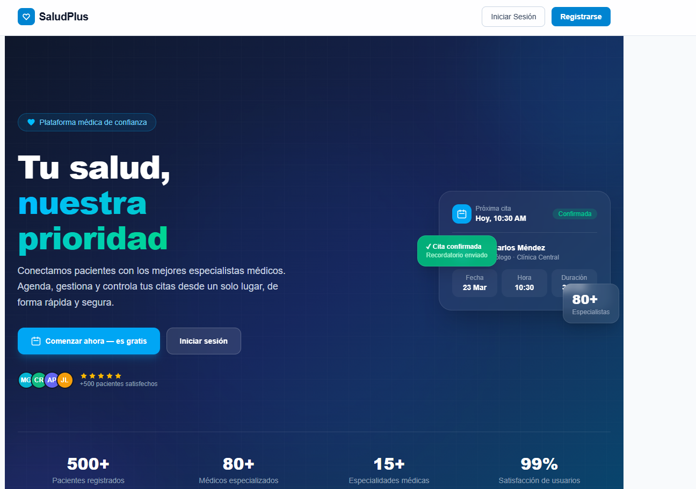  
*Figura 1: Pantalla principal de SaludPlus*

---

### 1.2 Iniciar sesión

Para acceder, el usuario ingresa su correo electrónico y contraseña registrados y presiona **"Iniciar sesión"**.

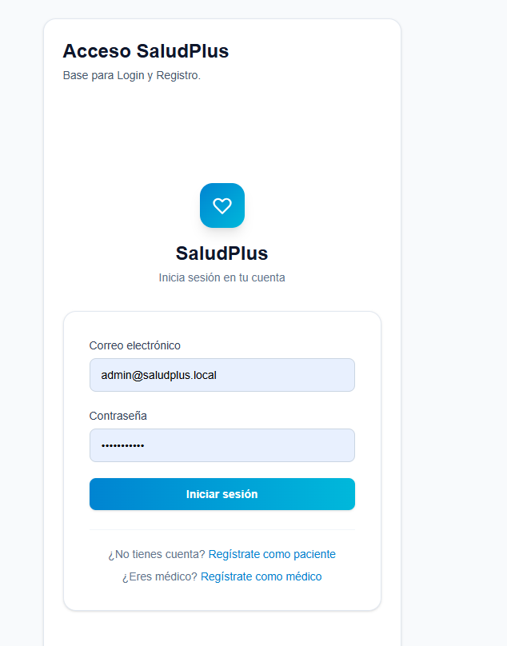  
*Figura 2: Formulario de inicio de sesión*

> **📌 Nota:** El sistema redirige automáticamente al panel correspondiente según el rol del usuario (Administrador, Médico o Paciente).

---

### 1.3 Verificación de dos factores (2FA) — Administrador

El acceso de administrador requiere un segundo factor de autenticación. Después de ingresar las credenciales, el sistema solicita subir el archivo `auth2-ayd1.txt` que contiene la contraseña 2FA.

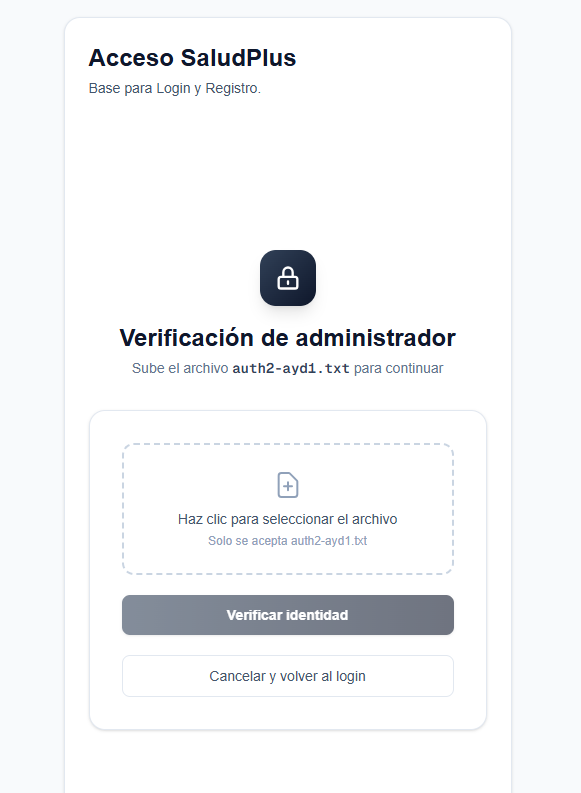  
*Figura 3: Pantalla de verificación de administrador (2FA)*

- Solo se acepta el archivo con nombre exacto: `auth2-ayd1.txt`
- Si se cancela, el sistema regresa al formulario de login

---

### 1.4 Registro de nuevo usuario

Los nuevos usuarios pueden registrarse como **paciente** o como **médico** desde la pantalla de login. El formulario solicita datos personales básicos y una fotografía opcional.

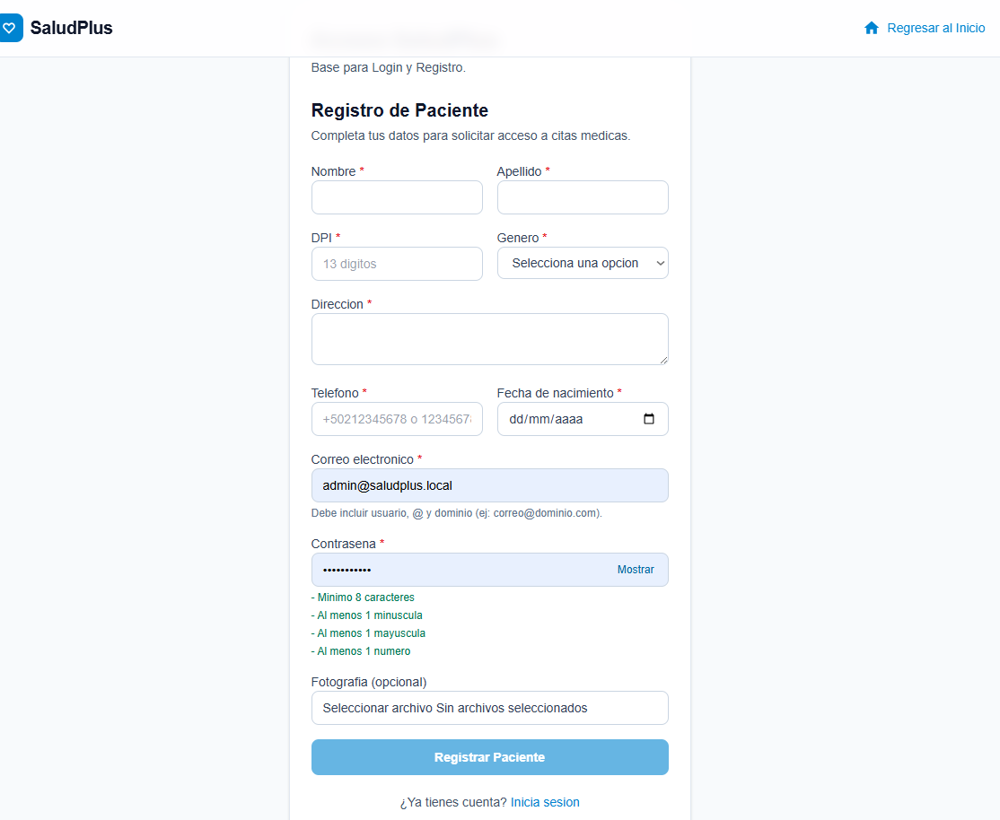  
*Figura 4: Formulario de registro de paciente*

**Campos requeridos:**

- Nombre y apellido
- DPI (13 dígitos)
- Género y dirección
- Teléfono y fecha de nacimiento
- Correo electrónico
- Contraseña (mín. 8 caracteres, al menos una mayúscula y un número)

> **📌 Nota:** Después del registro, la cuenta queda en estado `PENDING` hasta que el administrador la apruebe.

---

## 2. Rol Administrador

El administrador supervisa y controla el acceso a la plataforma. Gestiona usuarios, revisa solicitudes pendientes y consulta reportes estadísticos del sistema.

### 2.1 Panel de control

El dashboard presenta un resumen visual de la actividad de la plataforma mediante tarjetas de conteo con acceso directo a cada sección.

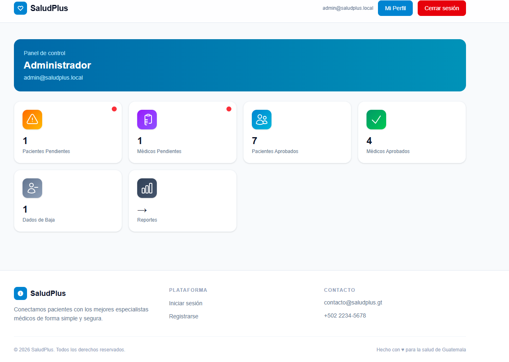  
*Figura 5: Panel de control del Administrador*

| Tarjeta | Descripción |
|---------|-------------|
| **Pacientes Pendientes** | Solicitudes de registro de pacientes por aprobar |
| **Médicos Pendientes** | Solicitudes de médicos por aprobar |
| **Pacientes Aprobados** | Total de pacientes activos en el sistema |
| **Médicos Aprobados** | Total de médicos activos |
| **Dados de Baja** | Usuarios desactivados |
| **Reportes** | Acceso directo al módulo de estadísticas |

> **📌 Nota:** Los puntos rojos en las tarjetas de pendientes indican que hay elementos esperando acción inmediata.

---

### 2.2 Gestión de pacientes pendientes

Al hacer clic en "Pacientes Pendientes", el administrador ve el listado de solicitudes de registro que aún no han sido procesadas. Cada tarjeta muestra los datos completos del solicitante.

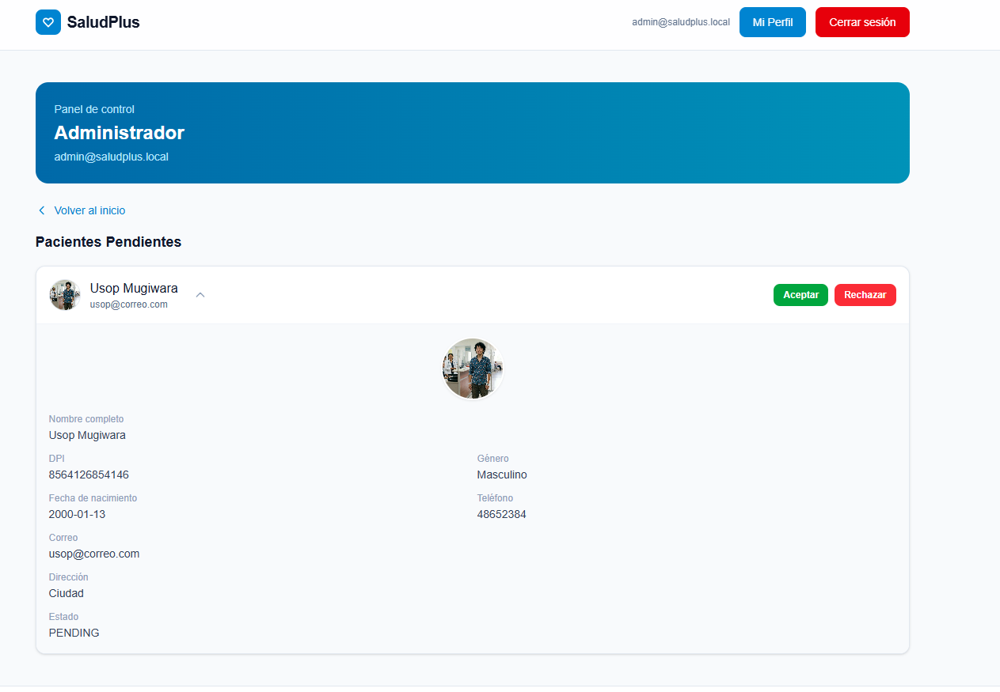  
*Figura 6: Lista de pacientes pendientes de aprobación*

- **Aceptar:** aprueba el registro y habilita el acceso al paciente
- **Rechazar:** deniega la solicitud de registro

---

### 2.3 Gestión de médicos pendientes

La sección de médicos pendientes permite revisar y aprobar o rechazar solicitudes de profesionales médicos que desean incorporarse a la plataforma.

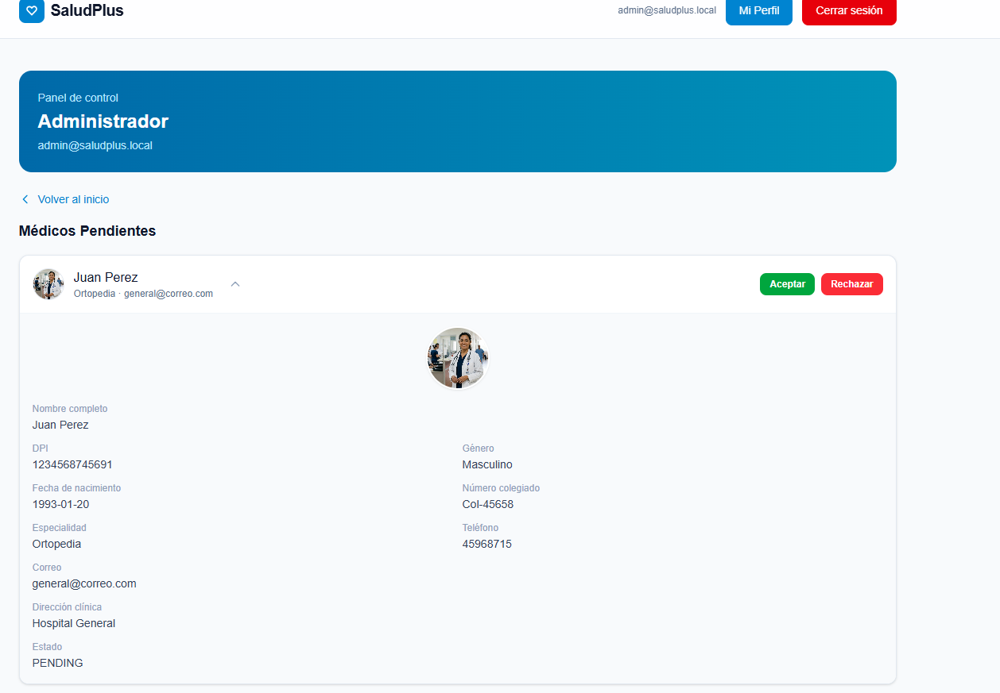  
*Figura 7: Lista de médicos pendientes de aprobación*

Los datos visibles del médico incluyen: nombre, especialidad, DPI, número colegiado, correo, dirección de clínica y estado del registro.

---

### 2.4 Listado de pacientes aprobados

Esta sección muestra todos los pacientes activos en el sistema. El administrador puede expandir cada registro para ver los detalles y tiene la opción de dar de baja a un usuario.

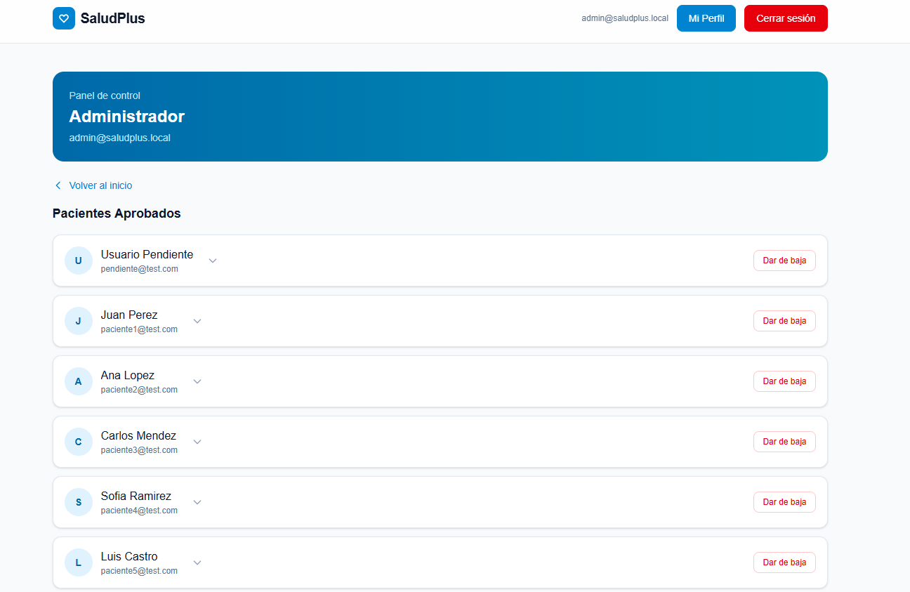  
*Figura 8: Listado de pacientes aprobados*

---

### 2.5 Listado de médicos aprobados

Muestra los médicos activos con todos sus datos profesionales expandibles. Permite dar de baja a médicos cuando sea necesario.

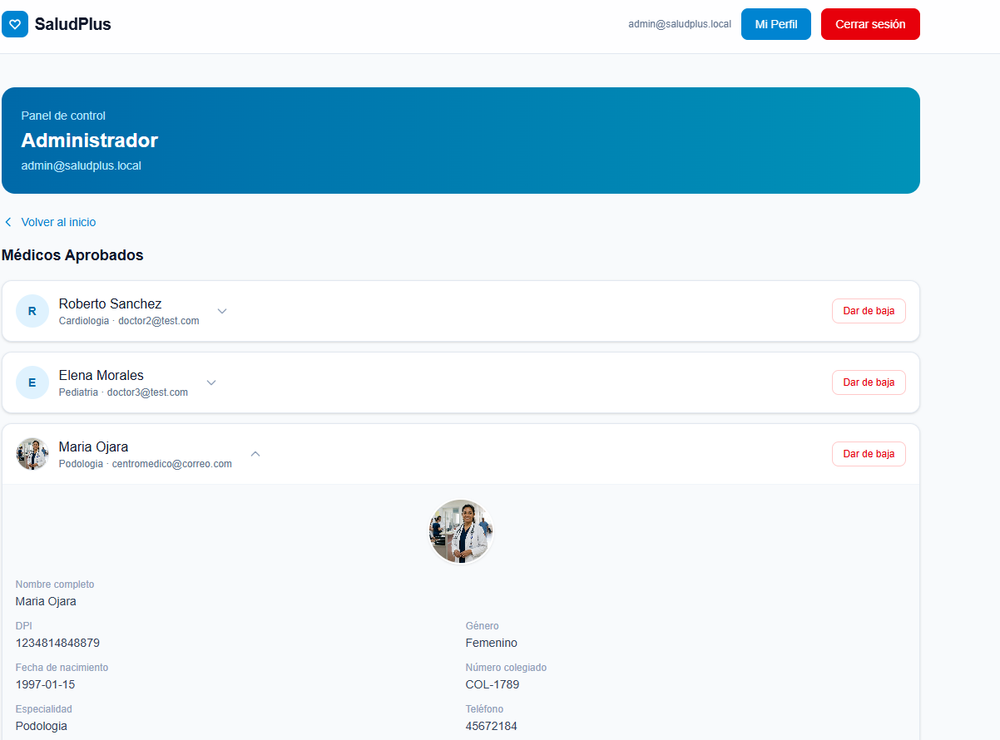  
*Figura 9: Listado de médicos aprobados con detalle expandido*

---

### 2.6 Reportes estadísticos

El módulo de reportes ofrece una vista analítica del desempeño de la plataforma con gráficas de barras y de tipo dona.

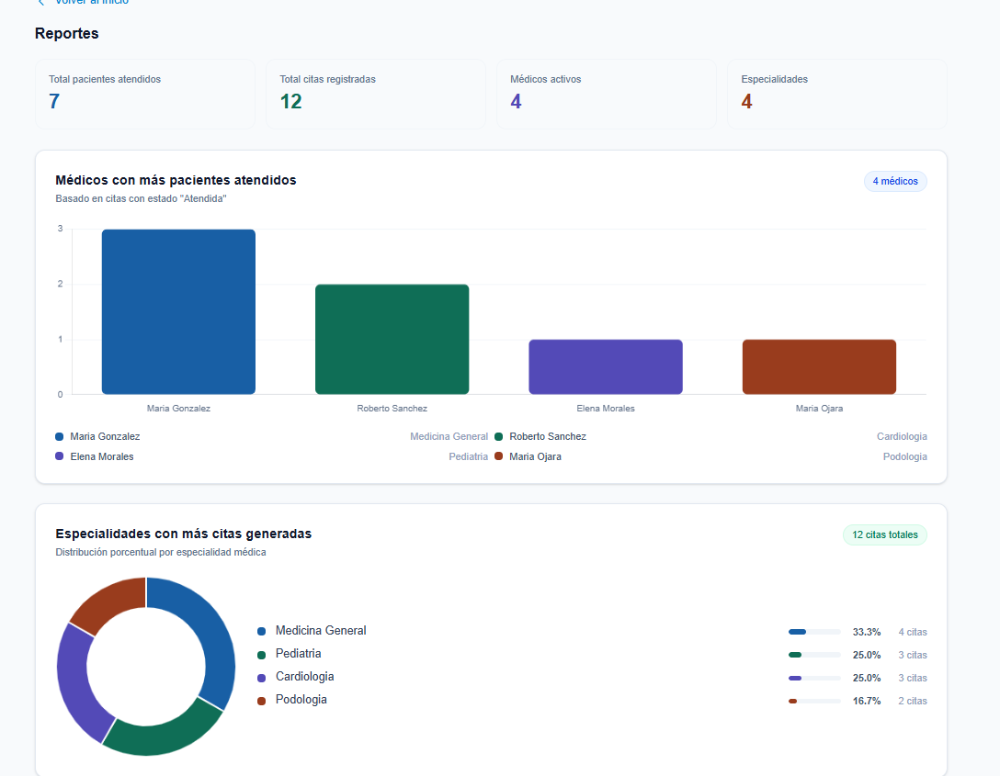  
*Figura 10: Panel de reportes estadísticos*

**Información disponible:**

- Total de pacientes atendidos, citas registradas, médicos activos y especialidades
- Gráfico de barras: médicos con más pacientes atendidos
- Gráfico de dona: distribución porcentual de citas por especialidad médica

---

### 2.7 Perfil del administrador

El perfil permite consultar los datos de la cuenta y gestionar las contraseñas de acceso, incluyendo la contraseña principal y la contraseña 2FA.

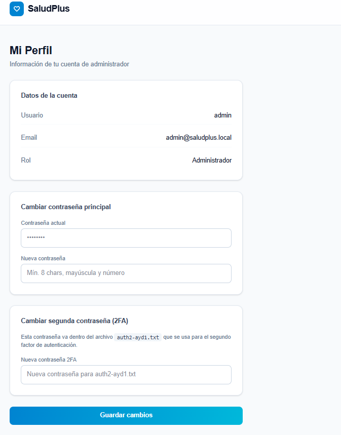  
*Figura 11: Perfil y configuración de cuenta del Administrador*

> **📌 Nota:** La contraseña 2FA es la que se almacena en el archivo `auth2-ayd1.txt` usado para el segundo factor de autenticación.

---

## 3. Rol Médico

El médico gestiona su disponibilidad horaria, atiende o cancela las citas asignadas y visualiza su agenda a través de un calendario interactivo.

### 3.1 Panel de citas

Al iniciar sesión, el médico accede a su panel principal que muestra las citas pendientes del día junto con el calendario mensual.

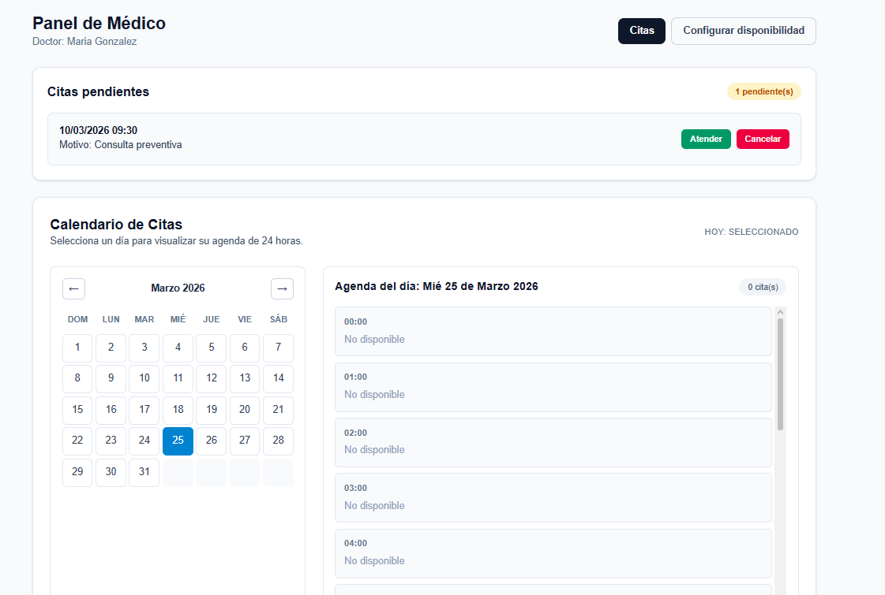  
*Figura 12: Panel de citas del médico con citas pendientes*

- **Citas pendientes:** lista de citas que requieren acción, con botones **"Atender"** y **"Cancelar"**
- **Calendario de citas:** vista mensual con selección de día para ver la agenda de 24 horas

---

### 3.2 Calendario de citas

Cuando no hay citas pendientes, el panel muestra únicamente el calendario con la agenda diaria hora por hora.

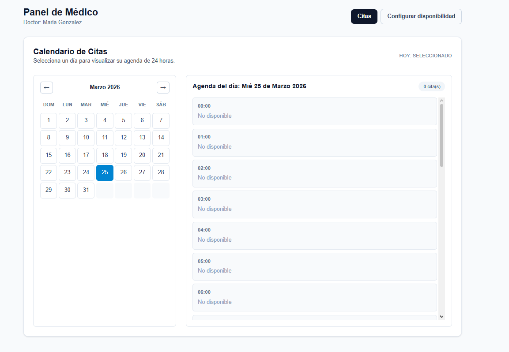  
*Figura 13: Vista del calendario de citas del médico*

> **📌 Nota:** El día actual aparece resaltado en azul. Al seleccionar un día se muestra la agenda con el estado de cada franja horaria: disponible, no disponible o con cita asignada.

---

### 3.3 Gestión de horarios

Desde el botón **"Configurar disponibilidad"** el médico define los días y horarios en que atiende pacientes. Estos horarios se publican de forma inmediata para que los pacientes puedan agendar.

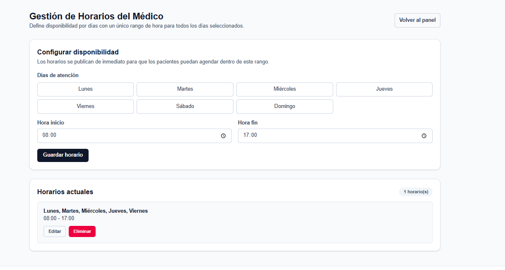  
*Figura 14: Configuración de disponibilidad horaria del médico*

**Pasos para configurar un horario:**

1. Seleccionar los días de atención (Lunes a Domingo)
2. Definir la hora de inicio y la hora de fin
3. Presionar **"Guardar horario"**
4. Los horarios actuales se listan en la sección inferior con opciones de **Editar** o **Eliminar**

> **📌 Nota:** Un mismo rango de horas aplica a todos los días seleccionados. Para horarios distintos por día, crear múltiples registros.

---

### 3.4 Perfil del médico

El perfil muestra los datos profesionales registrados en el sistema y permite actualizar la contraseña de acceso.

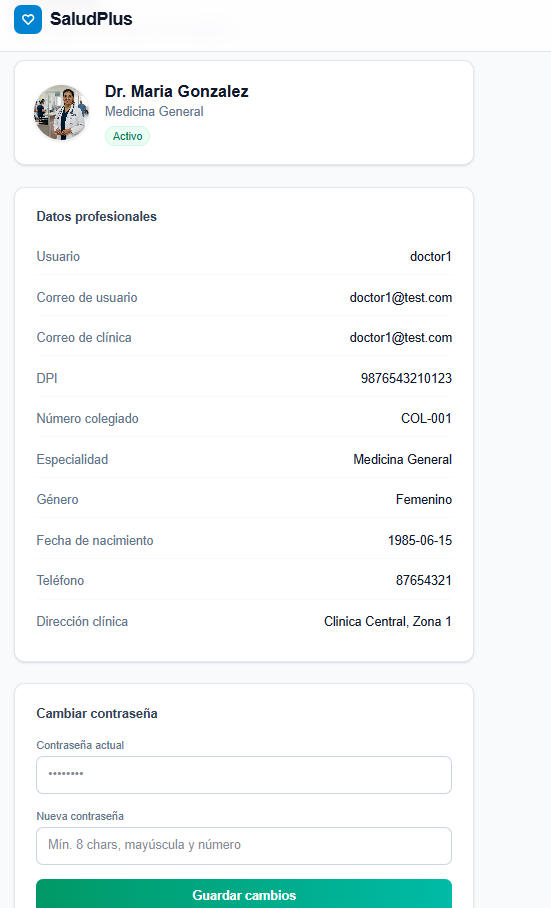  
*Figura 15: Perfil profesional del médico*

**Información visible:**

- Nombre completo, especialidad y estado de la cuenta (Activo)
- DPI, número colegiado, género y fecha de nacimiento
- Teléfono, dirección de clínica y correos de usuario/clínica

---

## 4. Rol Paciente

El paciente puede agendar citas con médicos especialistas, consultar su historial médico completo con diagnósticos y tratamientos, y gestionar su información personal.

### 4.1 Dashboard del paciente

Al iniciar sesión, el paciente ve un resumen personalizado con accesos rápidos a las funciones principales y el resumen de su actividad médica.

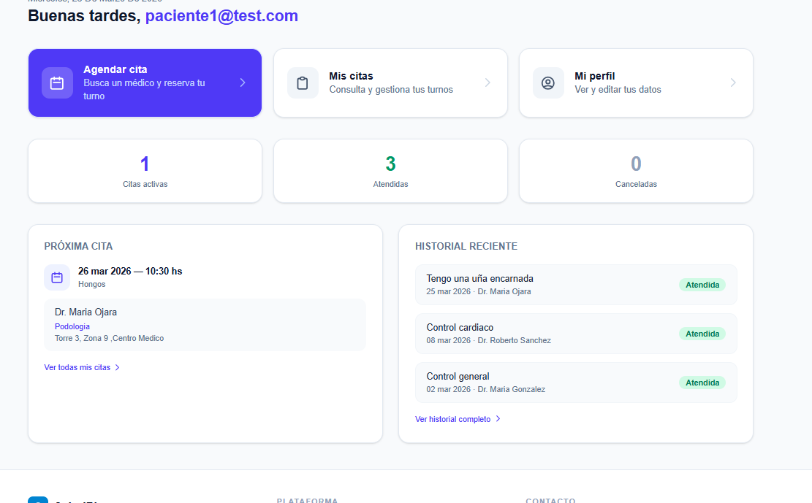  
*Figura 16: Dashboard del paciente*

| Sección | Contenido |
|---------|-----------|
| **Accesos directos** | Agendar cita, Mis citas y Mi perfil |
| **Contadores** | Citas activas, Citas atendidas y Citas canceladas |
| **Próxima cita** | Fecha, hora, motivo y datos del médico asignado |
| **Historial reciente** | Últimas tres citas con su estado |

---

### 4.2 Agendar cita — Paso 1: Elegir médico

Para programar una cita, el paciente primero elige al médico de su preferencia. La pantalla muestra todos los médicos aprobados con tarjetas que incluyen especialidad, clínica y teléfono.

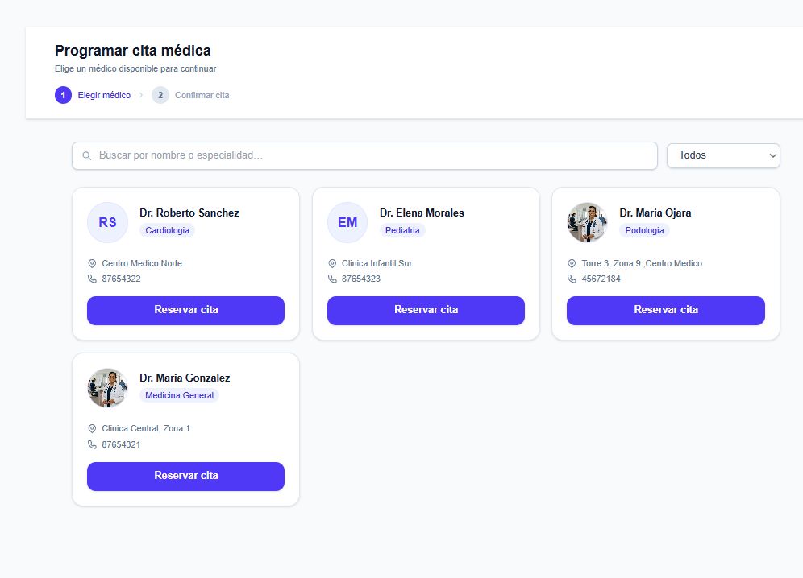  
*Figura 17: Selección de médico para agendar cita*

- Buscar por nombre o especialidad usando el campo de búsqueda
- Filtrar por especialidad con el selector desplegable
- Presionar **"Reservar cita"** en la tarjeta del médico elegido

---

### 4.3 Agendar cita — Paso 2: Confirmar cita

Una vez seleccionado el médico, el paciente completa el formulario eligiendo fecha, horario disponible y motivo de la consulta.

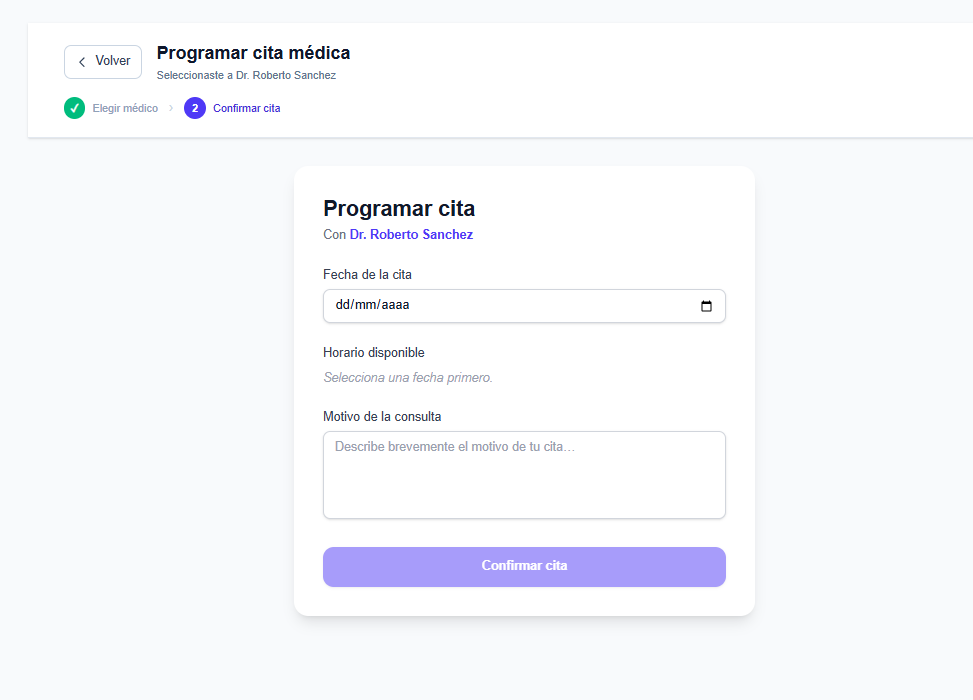  
*Figura 18: Formulario de confirmación de cita*

1. Seleccionar la **fecha** de la cita
2. Elegir el **horario disponible** del médico (se carga según la disponibilidad del día elegido)
3. Describir brevemente el **motivo de la consulta**
4. Presionar **"Confirmar cita"**

> **📌 Nota:** Los horarios disponibles se cargan dinámicamente según la disponibilidad configurada por el médico para el día seleccionado.

---

### 4.4 Mis citas médicas

La sección "Mis Citas Médicas" divide la información en dos columnas: citas activas (próximas) e historial médico completo.

  
*Figura 19: Citas activas e historial médico del paciente*

**Citas activas:**
- Fecha, hora y motivo de la cita
- Nombre del médico y clínica
- Botón **"Cancelar cita"** para cancelar si es necesario

**Historial médico:**
- Todas las citas atendidas con fecha y médico
- Tratamiento indicado por el médico (diagnóstico / receta)

---

### 4.5 Perfil del paciente

El perfil personal muestra toda la información registrada y permite editarla mediante el botón **"Editar perfil"**.

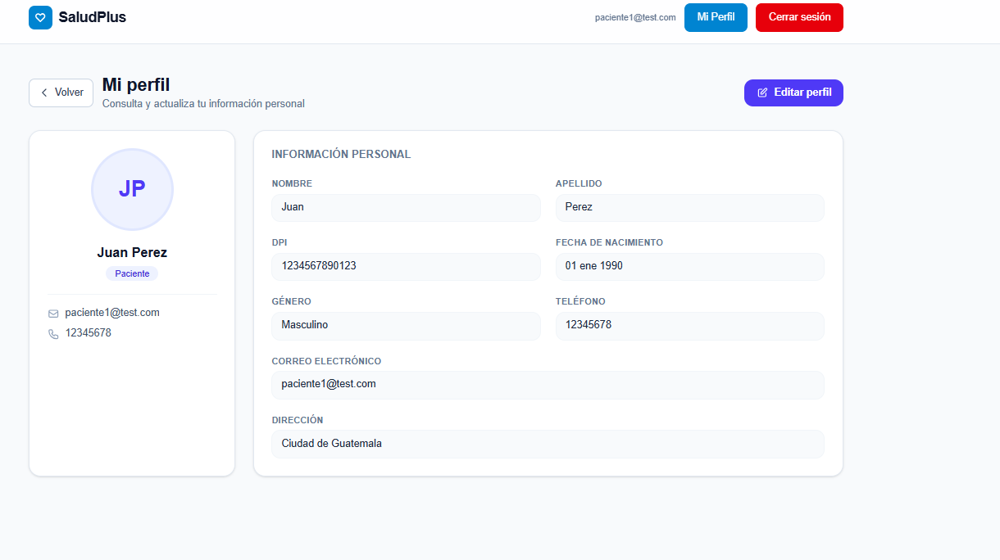  
*Figura 20: Perfil personal del paciente*

**Datos visibles y editables:**

- Nombre, apellido, DPI y fecha de nacimiento
- Género, teléfono y correo electrónico
- Dirección de residencia

---

## 5. Flujos principales

### 5.1 Flujo de registro y aprobación

```
Usuario se registra (paciente o médico)
        ↓
Cuenta queda en estado PENDING
        ↓
Administrador recibe notificación (punto rojo en dashboard)
        ↓
Administrador revisa los datos
        ↓
    Aprueba → Usuario puede iniciar sesión
    Rechaza → Solicitud denegada
```

---

### 5.2 Flujo de agendamiento de cita

```
Paciente inicia sesión
        ↓
Accede a "Agendar cita"
        ↓
Busca y selecciona médico
        ↓
Elige fecha, horario y escribe motivo
        ↓
Confirma la cita → Estado: Activa
        ↓
Médico visualiza la cita en su panel de pendientes
        ↓
Médico atiende y registra tratamiento indicado
        ↓
Cita pasa a estado: Atendida → aparece en historial del paciente
```

---

### 5.3 Flujo de configuración de disponibilidad (Médico)

```
Médico accede a "Configurar disponibilidad"
        ↓
Selecciona días de la semana
        ↓
Define hora de inicio y fin
        ↓
Guarda el horario → Se publica de inmediato
        ↓
Pacientes pueden agendar dentro del rango configurado
```

---

## 6. Preguntas frecuentes

**¿Qué hago si mi registro no fue aprobado?**  
Contacta al administrador de la plataforma. Es posible que los datos ingresados no sean correctos o estén incompletos.

---

**¿Puedo cancelar una cita ya confirmada?**  
Sí. Desde "Mis Citas" puedes cancelar cualquier cita activa usando el botón "Cancelar cita".

---

**¿Por qué no aparecen horarios disponibles para un médico?**  
El médico aún no ha configurado su disponibilidad o todos los turnos del día seleccionado están ocupados.

---

**¿Cómo recupero mi contraseña?**  
Contacta al administrador del sistema para que te asigne una nueva contraseña desde el perfil de usuario.

---

**¿El archivo `auth2-ayd1.txt` es permanente?**  
No. El administrador puede generar un nuevo archivo desde "Mi Perfil" actualizando la contraseña 2FA.

---

**¿Puede el médico ver el historial completo del paciente?**  
El médico puede ver el tratamiento indicado de sus propias citas atendidas. El historial completo es privado del paciente.

---

